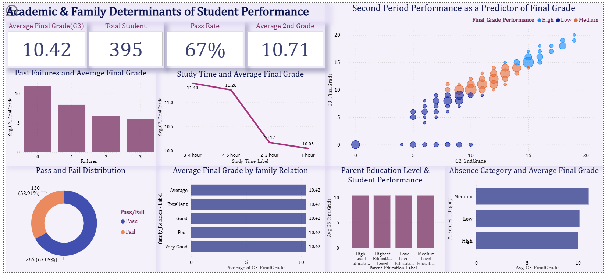
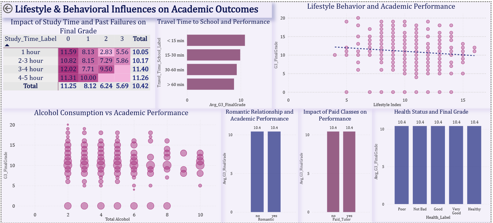

# Analyzing Factors Affecting Student Academic Performance

## Project Overview
This project analyzes the factors affecting secondary school students’ academic performance using Business Intelligence techniques and interactive data visualization. The analysis was performed using the UCI Student Performance dataset containing 395 students from two Portuguese secondary schools.

The main objective of this project was to identify the strongest predictors of final student performance (G3) and compare the impact of academic, family, and lifestyle-related variables through an interactive Power BI dashboard.

---

## Dataset
- Source: UCI Machine Learning Repository
- 395 students
- 33 original variables
- Includes academic, demographic, family, and lifestyle data

---
## Tools Used
- Excel
- Power BI
- Power Query
  

## Data Preparation
The project followed a complete BI workflow:

- Initial data exploration in Excel
- Normalization into Third Normal Form (3NF)
- Creation of 5 related tables:
  - Students
  - Demographics
  - Family
  - Lifestyle
  - Support
- Data transformation using Power Query
- Creation of derived features and DAX measures in Power BI

### Derived Features
- Pass / Fail
- Performance Category
- Lifestyle Index
- Total Alcohol Consumption
- Parent Education Groups

### DAX Measures
- Average Final Grade (G3)
- Average Second Grade (G2)
- Total Students
- Pass Rate

---

## Dashboard and Visualizations
Two interactive dashboard pages were created:

### Academic & Family Determinants
- G2 vs G3 Scatter Plot
- Failures Analysis
- Study Time Analysis
- Parent Education
- Family Relationship
- Pass/Fail Distribution

### Lifestyle & Behavioral Influences
- Lifestyle Index
- Alcohol Consumption
- Paid Tutoring
- Romantic Relationships
- Travel Time
- Health Analysis
- Heatmap Visualization

Visualization techniques included:
- Scatter plots
- Bar and column charts
- Donut charts
- Heatmaps
- Interactive filtering

---

## Key Findings
- G2 was the strongest predictor of final performance
- Past failures showed a strong negative impact on grades
- Study time had moderate influence
- Lifestyle and family-related factors showed weak or limited impact

Overall the analysis showed that academic history is a much stronger predictor of student success than lifestyle-related variables.

---

## Screenshots

### Academic & Family Dashboard

### Lifestyle & Behavioral Dashboard

---

## Conclusion
This project demonstrates how Business Intelligence and data visualization can be used to analyze educational data and identify meaningful performance patterns. The dashboard supports interactive exploration and highlights the importance of data driven decision making in education.

---

## Author
**Zainularab Zarabi**
